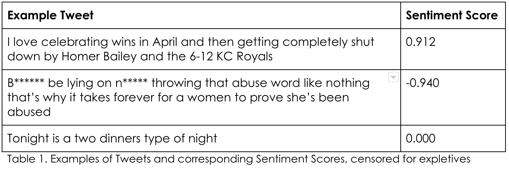
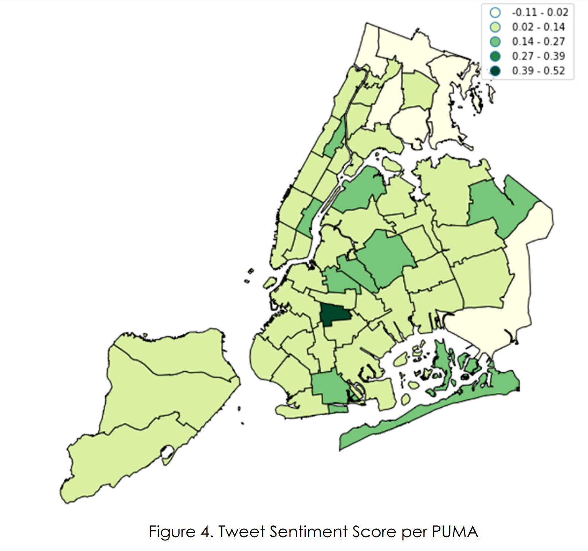
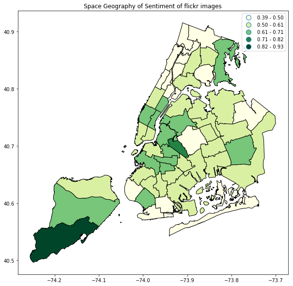
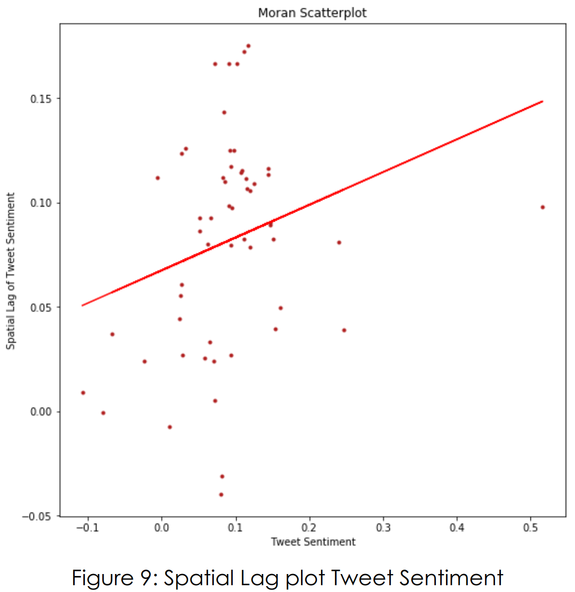
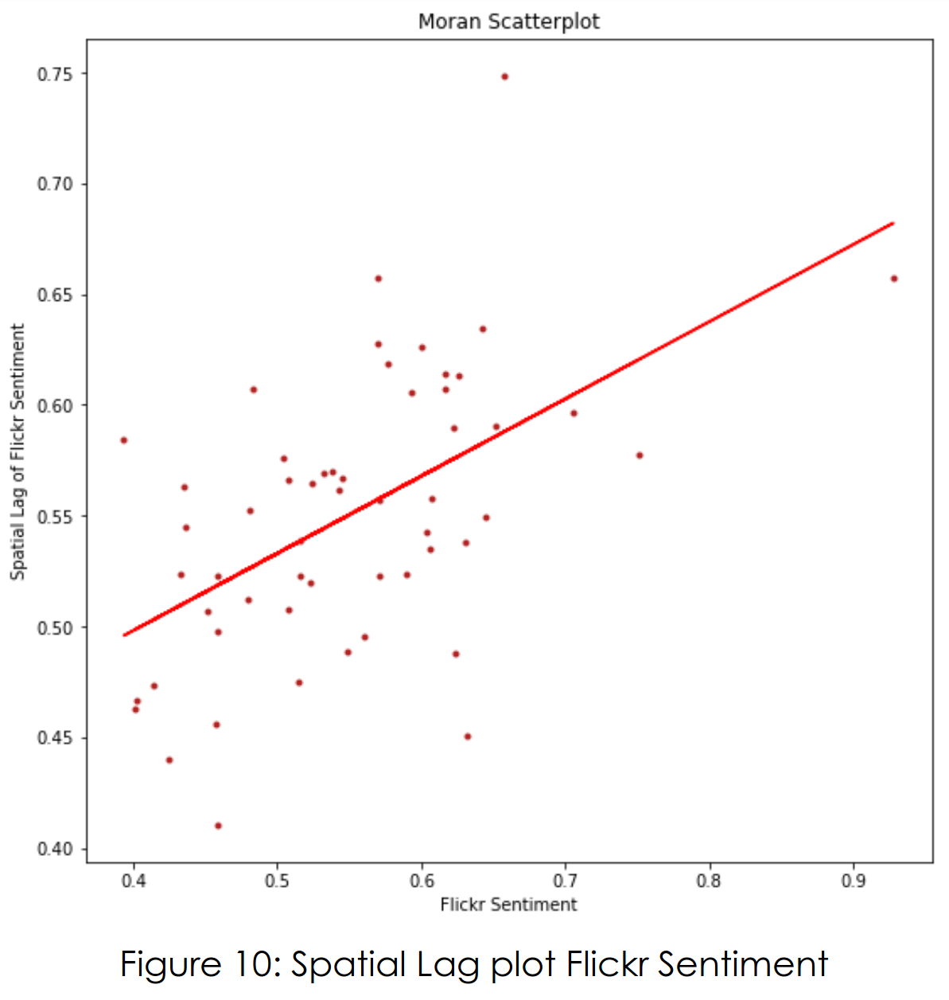

# Spatial Geography of Emotions in New York

## Twitter dataset
We first utilized the Twitter API to gather tweets from the live stream across New York City. Twitter API allows us to pass location parameters and filter the tweets geographically, so a bounding box of geolocations was passed as a filtering parameter to limit our data collection to the area of New York City. About 60,000 tweets were captured over a period of three days. We stored the data locally and then filtered out the tweets that were geotagged, which returned about 10,000 tweets. Next, we created a geodataframe from the geotagged tweets and performed a spatial join with the Public Use Microdata Area (PUMA) boundaries shapefile. The team decided to use PUMA boundaries because PUMAs are geographical units that the US Census utilise for providing statistical and demographic information, with each PUMA containing at least 100,000 people.  Consequently, we were able to create a PUMA-wise dataset of tweets over three days (18th April 2019 to 21st April 2019)  for New York City. Here, we note that the dataset of this size might not be representative - data was collected for a short span of time and our analysis might only hold for that period since there can be temporal patterns in the way emotions are exhibited in tweets. 

## Textual Sentiment Analysis
We used an open source python package Natural Language ToolKit (NLTK) for sentiment analysis of the tweets. The NLTK package is commonly used for text analytics and is specifically capable of analyzing people’s sentiments from text sequences in a computationally affordable manner. We chose the NLTK over other more intricate Natural Language Processing (NLP) Libraries for simplicity. The Sentiment Intensity Analyzer function from NLTK assigns a polarity score to each tweet, ranging from -1 to 1, allocating a score of 1 if the tweet has the most positive sentiment and -1 if the tweet has the most negative sentiment. Finally, we aggregated the sentiment scores across geographical locations in New York City by getting the mean sentiment score, to achieve tweet sentiment scores for each individual PUMA.

## Flickr Face Dataset 
We next utilized the Flickr API to collect a collection of datasets of Flickr images contained within each of the PUMA. Initially, we extracted the centroid points for each PUMA and then used them as geo-coordinates for collection of geotagged images from Flickr API. Images within 5km radius from these PUMA centroids were assigned to that PUMA. For each PUMA we collected 1000 Flickr images. We then used an open source Dlib face detector to select the images that contained at least one face. This allowed us to create a dataset of faces for each PUMA.

## Visual Sentiment Analysis
Microsoft provides a cloud-based computer vision service called Face API. It first detects human faces with a face bounding box, and with machine learning-based predictions of facial features, it will return face attribute features of predicted Age, Emotion, Gender, Pose, Smile and Facial Hair for each of the face detected in the image. The emotions registered by the web API are: (1) Happiness, (2) Neutral, (3) Contempt, (4) Disgust, (5) Anger, (6) Surprise, (7) Fear and (8) Sadness, and returns a probability score of the person in the image reflecting the particular emotion. The total probability score will add up to a total of 1. Apart from performing emotion classification, we also calculated the polarity score by adding up positive emotions and subtracting negative emotions. We categorised positive, neutral, and negative emotions in the following way:
- Positive: Happiness
- Neutral: Neutral, Surprise
- Negative: Contempt, Disgust, Anger, Fear, Sadness
This score ranged from -1 to 1 with -1 being extremely negative and 1 being most positive emotion. 0 would mean a neutral emotion. Finally, we aggregated our measures at PUMA level and visualized the results. An example of the emotion classification is as follows:

## Relation between Tweet and Flickr Sentiments
We investigated the PUMA-wise scores for any possible relationship between the sentiments observed in tweets and flickr images for same PUMAs. We then used the pearson’s correlation test to measure if there is any linear correlation between the polarity scores computed for both datasets. We found a very weak correlation of 0.119, but the P-value of 0.3 renders this result statistically insignificant. Thus, we did not find any conclusive evidence that similar emotions are exhibited on these platforms for similar regions. We would also like to note that given out dataset size and limited time of span for which we collected data, our results might not be representative of the broader and more stable trends. Additionally, there may be one significant event happening within one or more PUMAs, skewing the dataset with bias. 

## Spatial Relation in Tweet and Flickr Sentiments
We measure Global Moran’s I to calculate the spatial autocorrelation. Global Moran’s I calculates correlation between a single variable and its spatial lag. It is an indicator of global trend. Values range from -1 to +1, with positive values indicating clustering of similar values, negative values indicating dispersed trend where closer areas have different values, while 0 indicates randomness and an absence of spatial trend. For calculating, we built a Queens contiguity matrix from the PUMA shapefile. It is a simple contiguity matrix of 1-0, if two geographies touch each other it is 1 otherwise 0. Distance based matrices are better but we limit ourselves to a Queens matrix for simplicity.

Tweet Sentiment shows a Moran’s I of 0.157 which shows slight clustering of similar emotions in nearby areas. With a p-value of 0.027 the result gained is deemed to be statistically significant. Some trend is also visible from the spatial lag plot shown below. The slope of the red line indicates the global moran’s I.

Flickr Sentiment shows a stronger Moran’s I of 0.349, which shows a relatively stronger  clustering of similar emotions in nearby areas. With a p-value of 0.001, the result gained is deemed to be statistically significant. The spatial lag plot below shows a clearer trend. So sentiment exhibited by Flickr images has a stronger spatial autocorrelation than sentiments in tweets.

## Team
Urwa Muaz, Rachel Sim, Kloe Ng
[full report](https://github.com/muaz-urwa/Emotional-Geography-using-Computer-Vision-and-NLP/blob/master/Emotional%20Geography%20of%20Newyork.pdf)

#### Dependencies:

- opencv (pip install opencv-python)
- dlib
- tweepy
- flickrapi
- geopandas
- nltk

### Scripts
- Collect Tweets by Location: for a bounding box of geo-coordinates, this cript collects tweets using twitter stream listener and stores them as json files.
- Get  Flickr Faces by GeoLocation: this collects the flickr images within a certian radius for the provided geolocations and stores them in a specified directory. (use for landmark image collection)
- Get  Flickr Faces by PUMA: collects flickr images for each PUMA and stores them in a specified directory.
- Geosentiment_tweet_Location: Calculates aggregated sentiment scores for the specified locations.
- Geosentiment_tweet_PUMA: Calculates aggregates sentiment scores PUMA wise. 
- Sample_Frames_video: samples and stores frames from video files.
- geosentiment_flickr_puma: calculates puma wise emotions using microsoft face API and puma images dataset
- geosentiment_flickr_landmark: calculates aggregate emotions for landmark image data using microsoft face api
